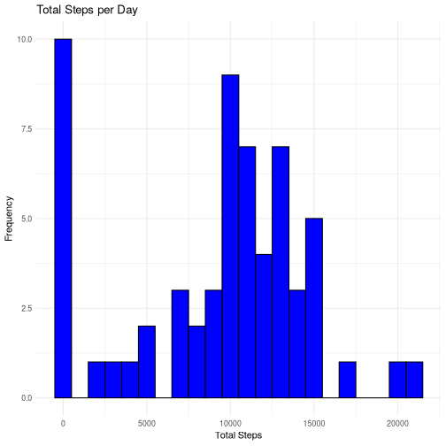
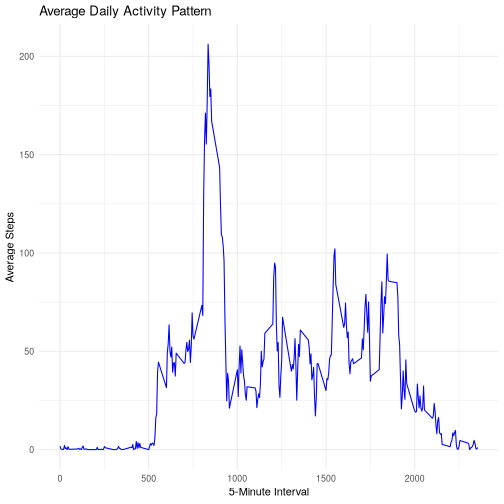
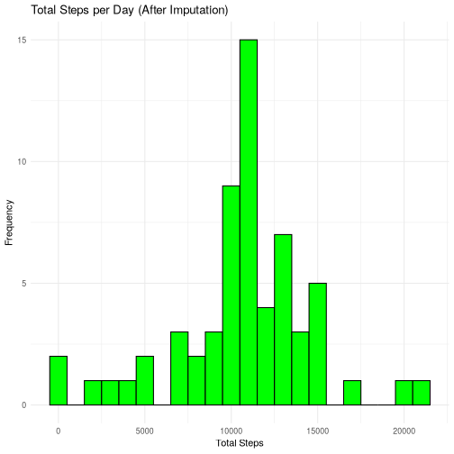
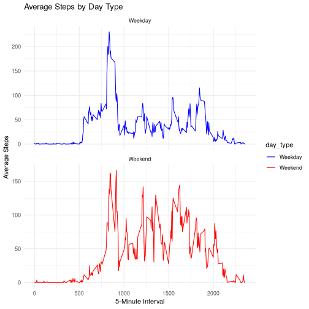

## Loading and preprocessing the data
Check the `activity.csv` file in the current working directory. If it does not exist, unzip the `activity.zip` file to extract it.

``` r
if (!file.exists("activity.csv")) {
  unzip("activity.zip")
}
```

Read the data from the CSV file and convert the date column to Date type.

``` r
library(dplyr)
activity_data <- read.csv("activity.csv", stringsAsFactors = FALSE)
activity_data$date <- as.Date(activity_data$date, format = "%Y-%m-%d")
# Check the structure of the data
paste("Summary of the dataset:")
```

```
## [1] "Summary of the dataset:"
```

``` r
summary(activity_data)
```

```
##      steps             date               interval     
##  Min.   :  0.00   Min.   :2012-10-01   Min.   :   0.0  
##  1st Qu.:  0.00   1st Qu.:2012-10-16   1st Qu.: 588.8  
##  Median :  0.00   Median :2012-10-31   Median :1177.5  
##  Mean   : 37.38   Mean   :2012-10-31   Mean   :1177.5  
##  3rd Qu.: 12.00   3rd Qu.:2012-11-15   3rd Qu.:1766.2  
##  Max.   :806.00   Max.   :2012-11-30   Max.   :2355.0  
##  NA's   :2304
```

## What is mean total number of steps taken per day?
Histogram of total steps taken each day.

``` r
library(ggplot2)
total_steps_per_day <- activity_data %>%
  group_by(date) %>%
  summarise(total_steps = sum(steps, na.rm = TRUE))
ggplot(total_steps_per_day, aes(x = total_steps)) +
  geom_histogram(binwidth = 1000, fill = "blue", color = "black") +
  labs(title = "Total Steps per Day", x = "Total Steps", y = "Frequency") +
  theme_minimal()
```



The mean and median of the total number of steps taken per day.
Note that, the missing value in the `steps` column will be treated as zero in the total steps calculation. This approach eliminates the error of not accounting for days with missing data.

``` r
mean_steps <- mean(total_steps_per_day$total_steps, na.rm = TRUE)
median_steps <- median(total_steps_per_day$total_steps, na.rm = TRUE)

paste("Mean steps per day:", mean_steps)
```

```
## [1] "Mean steps per day: 9354.22950819672"
```

``` r
paste("Median steps per day:", median_steps)
```

```
## [1] "Median steps per day: 10395"
```

## What is the average daily activity pattern?
The time series plot of the 5-minute interval and the average number of steps taken, averaged across all days.

``` r
average_steps_per_interval <- activity_data %>%
  group_by(interval) %>%
  summarise(average_steps = mean(steps, na.rm = TRUE))
ggplot(average_steps_per_interval, aes(x = interval, y = average_steps)) +
  geom_line(color = "blue") +
  labs(title = "Average Daily Activity Pattern", x = "5-Minute Interval", y = "Average Steps") +
  theme_minimal()
```



``` r
# Find the interval with the maximum average steps
max_interval <- average_steps_per_interval$interval[which.max(average_steps_per_interval$average_steps)]
max_steps <- max(average_steps_per_interval$average_steps, na.rm = TRUE)
paste("Interval with maximum average steps:", max_interval)
```

```
## [1] "Interval with maximum average steps: 835"
```

``` r
paste("Maximum average steps:", max_steps)
```

```
## [1] "Maximum average steps: 206.169811320755"
```

## Imputing missing values
Calculate the total number of missing values in the dataset.

``` r
total_missing <- sum(is.na(activity_data$steps))
paste("Total missing values in steps:", total_missing)
```

```
## [1] "Total missing values in steps: 2304"
```

Impute missing values by replacing them with the mean of the corresponding 5-minute interval.


``` r
activity_data_imputed <- activity_data %>%
  group_by(interval) %>%
  mutate(steps = ifelse(is.na(steps), mean(steps, na.rm = TRUE), steps)) %>%
  ungroup()

# Recalculate total steps per day after imputation
total_steps_per_day_imputed <- activity_data_imputed %>%
  group_by(date) %>%
  summarise(total_steps = sum(steps, na.rm = TRUE))


# Histogram of total steps per day after imputation
ggplot(total_steps_per_day_imputed, aes(x = total_steps)) +
  geom_histogram(binwidth = 1000, fill = "green", color = "black") +
  labs(title = "Total Steps per Day (After Imputation)", x = "Total Steps", y = "Frequency") +
  theme_minimal()
```



``` r
# Mean and median of total steps per day after imputation
mean_steps_imputed <- mean(total_steps_per_day_imputed$total_steps, na.rm = TRUE)
median_steps_imputed <- median(total_steps_per_day_imputed$total_steps, na.rm = TRUE)
paste("Mean steps per day (after imputation):", mean_steps_imputed)
```

```
## [1] "Mean steps per day (after imputation): 10766.1886792453"
```

``` r
paste("Median steps per day (after imputation):", median_steps_imputed)
```

```
## [1] "Median steps per day (after imputation): 10766.1886792453"
```

``` r
paste("Difference in mean steps before and after imputation:", mean_steps_imputed - mean_steps)
```

```
## [1] "Difference in mean steps before and after imputation: 1411.95917104856"
```

``` r
paste("Difference in median steps before and after imputation:", median_steps_imputed - median_steps)
```

```
## [1] "Difference in median steps before and after imputation: 371.188679245282"
```
The impact of imputing missing data on the estimates of the total daily number of steps is significant. The `mean` and `median` values increased after imputation, indicating that the missing data had a downward bias on the original estimates. This suggests that the original dataset underestimated the total daily activity levels.


## Are there differences in activity patterns between weekdays and weekends?
Create a new factor variable indicating whether the date is a weekday or weekend.

``` r
activity_data_imputed <- activity_data_imputed %>%
  mutate(day_type = ifelse(weekdays(date) %in% c("Saturday", "Sunday"), "Weekend", "Weekday"))
```

Plot the average number of steps taken in each 5-minute interval, separated by weekday and weekend.
The plot shows the average number of steps taken in each 5-minute interval, with separate lines for weekdays and weekends.

``` r
average_steps_per_interval_day_type <- activity_data_imputed %>%
  group_by(interval, day_type) %>%
  summarise(average_steps = mean(steps, na.rm = TRUE))
```

```
## `summarise()` has grouped output by 'interval'. You can override using the
## `.groups` argument.
```

``` r
ggplot(average_steps_per_interval_day_type, aes(x = interval, y = average_steps)) +
  geom_line(aes(color = day_type)) +
  facet_wrap(~day_type, ncol = 1, scales = "free_y") +
  labs(title = "Average Steps by Day Type", x = "5-Minute Interval", y = "Average Steps") +
  scale_color_manual(values = c("Weekday" = "blue", "Weekend" = "red")) +
  theme_minimal()
```


